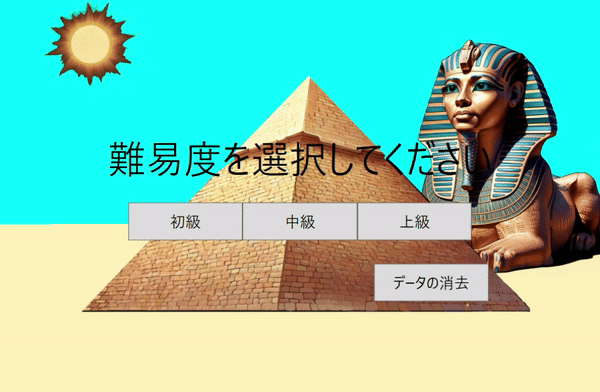

# **ピラミッド計算のアプリケーション**

## **はじめに**

- 本リポジトリは、C#学習の一環として作成した練習用アプリケーションです

- 使用に伴うトラブルについては、責任を負いかねますのでご了承ください

## **コンセプト**
- 昔、PCに内蔵されていた計算ゲームをもう一度遊びたいと思ったのがきっかけです。探しても類似のものが見つからなかったため、自分で作成しました

- 初心者の作品ではありますが、温かい目で見ていただけると幸いです

## **ゲーム概要**

- ピラミッド型の計算ゲーム
    - 数字を組み合わせてピラミッドの頂上を目指す計算ゲームです。

- 3つの難易度を選択可能
    - 初級、中級、上級から難易度を選んでプレイできます

- 操作方法
    1. 難易度を選択して、画面が切り替わったらスペースキーを押してゲームを開始します
    2. スペースキーを押す前に入力が半角であることを確認してください。全角ではゲームが開始できません

- ランキング機能
    - 各難易度のランキングを保存・表示します。また、ランキングを消去したい場合は「データ消去」ボタンをクリックし、該当する難易度を選択してください

## **デモ動画**

## **環境**

- OS: Windows11

- 開発言語: C# /.NET 8 / WPF

- 検証済みOS: Windows11

## **利用方法**

### **インストール**

1. リポジトリをクローンします:
    - git clone https://github.com/FK21520/pyramid_calculation.git

2. または、右上の [Code] ボタンをクリックし、ZIPファイルをダウンロードしてください。

### **実行方法**

1. ダウンロードしたフォルダを開きます

2. pyramid.exe をダブルクリックして実行してください

## **実装予定の機能**

- 四則演算の拡張
    - 減算、乗算、除算の追加

- 減算、乗算、除算を追加予定です
    - デモページを追加し、よりわかりやすく解説します

## **おわりに**

- 本リポジトリは、C#学習のアウトプットとして公開しました

- ご感想やフィードバックがあれば、ぜひ以下のX（旧Twitter）アカウントまでご連絡ください

Xアカウント: @WyuAdlMdaG7807